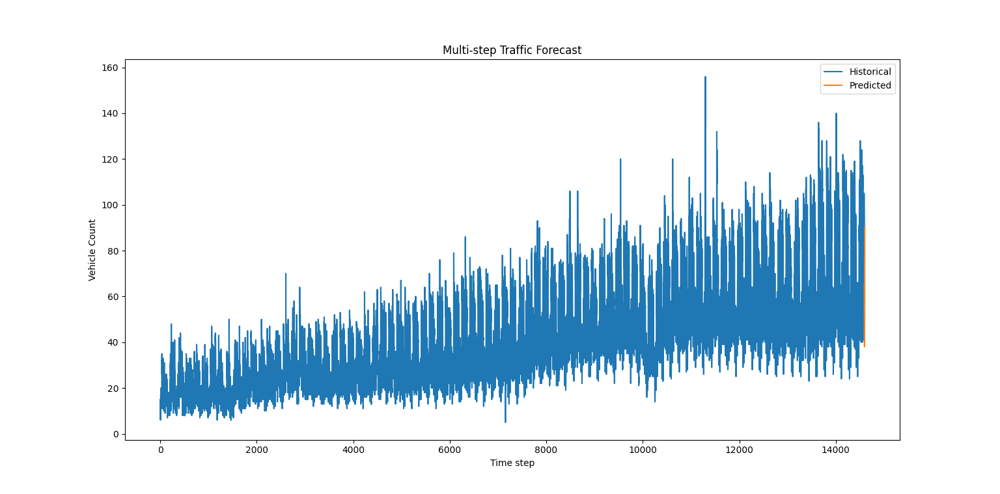

# Traffic Prediction Model

This project implements a traffic volume prediction system using a GRU (Gated Recurrent Unit) neural network in PyTorch. It predicts future traffic counts at specific junctions based on historical traffic data.

---

## Project Structure

```
traffic_predection_model/
├── train.py                  # Script to train the GRU model
├── predict.py                # Script to make predictions using the trained model
├── evaluate.py               # Script to evaluate model performance and visualize results
├── models/
│   └── traffic_gru.py        # GRU model architecture
├── utils/
│   ├── preprocess.py         # Data preprocessing utilities (scaling, sequence creation)
│   ├── visualization.py      # Visualization functions (plot predictions)
│   └── __init__.py
├── data/
│   └── traffic.csv           # Traffic dataset (CSV file)
├── trained_model.pth         # Saved trained model weights
└── README.md                 # Project overview and instructions
```


## 📊 Traffic Flow Prediction Result

This plot compares the actual and predicted number of vehicles using the trained GRU model:



---

## Setup

Make sure you have Python 3.8+ and install the required packages:

```bash
pip install pandas numpy torch matplotlib scikit-learn
```

---

## Usage

### 1. Train the model

```bash
python train.py
```

This script preprocesses the data, trains the GRU model for 10 epochs, and saves the trained weights to `trained_model.pth`.

### 2. Make predictions

```bash
python predict.py
```

This script loads the trained model and predicts the next traffic count based on the latest available data.

### 3. Evaluate and visualize results

```bash
python evaluate.py
```

Evaluates the model on the test dataset, prints Mean Squared Error (MSE) and Mean Absolute Error (MAE), and plots actual vs predicted traffic counts.

---

## File Descriptions

- `train.py` — Loads dataset, preprocesses data, trains the GRU model, saves weights.
- `predict.py` — Loads saved model weights, predicts traffic count for latest data window.
- `evaluate.py` — Evaluates model performance and visualizes predictions.
- `models/traffic_gru.py` — Defines the GRU model class.
- `utils/preprocess.py` — Functions for normalization and sequence creation.
- `utils/visualization.py` — Contains plotting functions to visualize results.
- `data/traffic.csv` — Raw traffic data used for training and testing.

---

## Notes

- The model uses a sequence length of 10 time steps (configurable).
- Data is normalized using MinMaxScaler before training.
- The prediction outputs are inverse-transformed back to original scale for interpretation.
- Future improvements can include using BiGRU, LSTM, or advanced graph-based models.

---

## References

- [PyTorch Documentation](https://pytorch.org/docs/stable/index.html)
- [METR-LA Dataset](https://github.com/liyaguang/DCRNN)
- [Traffic Forecasting Survey](https://arxiv.org/abs/1708.04811)

---

Feel free to open issues or contribute improvements!

---

*Created by Sourabh Gorkhe*
